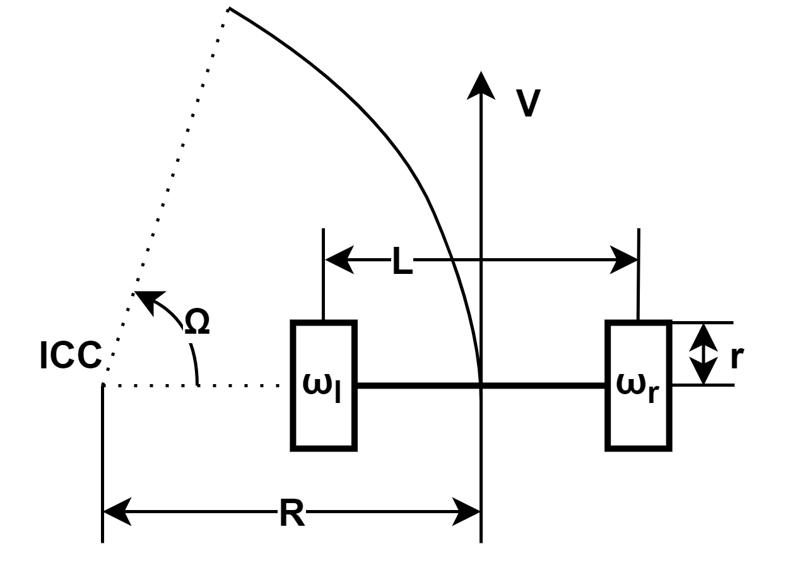
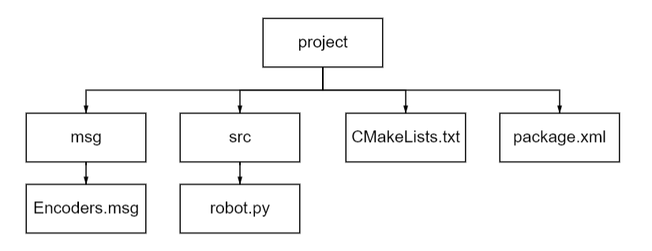
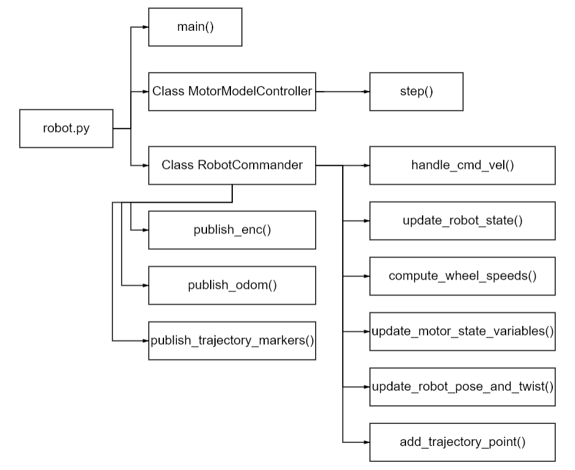

# **Моделирование робота с дифференциальным приводом**
*Ubuntu 20.04*  
*ROS noetic 1.16.0*
## **Описание модели**
В рамках [задания](https://github.com/McGorky/ros-hw) был создан пакет, включающий в себя узел для симуляции робота с дифференциальным приводом. Управление роботом производится с помощью нажатия клавиш WASDX с использованием пакета [turtlebot3_teleop](http://wiki.ros.org/turtlebot3_teleop):
- W: увеличить скорость;
- X: уменьшить скорость;
- S: тормоз;
- A: увеличить угловую скорость;
- D: уменьшить угловую скорость. 

Созданный узел содержит 4 топика:
- **/enc:** публикует показания энодеров;
- **/odom:** публикует положение и скорость робота;
- **/cmd_vel:** подписывается на управляющие команды для линейной и угловой скоростей;
- **/trajectory_markers:** публикует маркеры в **RViz**.

Визуализация движения робота производится в **RViz**. Модель робота выглядит следующим образом:


```
ICC - мгновенный центр скоростей 
Ω - угловая скорость вращения центра робота вокруг МЦС 
R - расстояние от МЦС до центра робота 
L = 0.287 - расстояние между колесами 
r = 0.033 - радиус колес 
V - линейная скорость робота 
ω - угловые скорости колес
```
Изменение угловой скорости моделируется в виде апериодического звена с коэффициентом усиления $k=1$ и постоянной времени $T=1$. Основные вычисления осуществляются по формулам:

$x = V * cos(\Theta) * dt$  

$y = V * sin(\Theta) * dt$  

$\Theta = \Omega * dt$  

$V = \frac{r}{2} * (\omega_{l}+\omega_{r})$  

$\Omega = \frac{r}{L} * (\omega_{r}-\omega_{l})$ 

Из последних двух уравнений можно вывести формулы для нахождения $\omega_{r}$ и $\omega_{l}$:

$\omega_{l} = \frac{2V-l\Omega}{2r}$  

$\omega_{r} = \frac{2V+l\Omega}{2r}$  


## **Описание ПО**
Структура пакета:

- Файл **Encoders.msg** содержит  поле типа **Header** и два **uint32** поля.
- В файл **CMakeLists.txt** добавлены:  
    - пакеты: `roscpp`, `rospy`, `std_msgs`, `project`, `geometry_msgs`, `visualization_msgs`;
    - файлы: **Encoders.msg**;
    - зависимости: `std_msgs`, `nav_msgs`, `geometry_msgs`.   

- В файл **package.xml** добавлены зависимости: `roscpp`, `rospy`, `std_msgs`, `geometry_msgs`, `nav_msgs`, `message_generation`, `visualization_msgs`.

Структура файла **robot.py** приведена ниже. 

### **main()**
```python
if __name__ == '__main__':
    rospy.init_node("Robot")
    rate = rospy.Rate(10)  # 10hz
    com = RobotCommander()
    while not rospy.is_shutdown():
        com.publish_enc()
        com.publish_odom()
        com.publish_trajectory_markers()
        rate.sleep()
```
### **Class MotorModelController**
Класс моделирует работу мотора робота. Каждому объекту принадлежат следующие переменные: модель системы `sys`, текущее состояние `x`, время последнего шага `t` в секундах, текущая целевая скорость `w_target`, а также показание энкодера `enc`. 
```python
def __init__(self):
        k = 1
        T = 1
        W = control.tf(k, [T, 1])
        self.sys = control.LinearIOSystem(W)
        self.x = [[0, 0]]
        self.t = rospy.Time.now().to_sec()
        self.w_target = 0
        self.enc = 0
```

- ### **step()**

Данный метод описывает каждый шаг моделирования. Вычисляется разница между показаниями энкодера на текущей и предыдущей итерациях, а также угловая скорость каждого колеса `true_w`, которая находится по формуле:  

$\omega = \frac{2\pi * \Delta E }{N * dt}$  

Метод возвращает угловую скорость колеса и время между измерениями.
```python
def step(self, w_target):
        t = rospy.Time.now().to_sec()
        a, w, self.x = control.input_output_response(self.sys, 
                                                    [self.t, t],
                                                    [self.w_target, w_target], 
                                                    self.[0][1],
                                                    return_x=True)
        dt = t - self.t
        d_enc = int(w[1] * dt / 2 / pi * 4096)
        true_w = d_enc * 2 * pi / dt / 4096
        self.enc += d_enc
        self.t = t
        self.w_target = w_target
        return true_w, dt
```
### **Class RobotCommander**
Класс предназначен для публикации сообщений и управления роботом. В функции инициализации создаются топики и инициализируются некоторые переменные. 
```python
def __init__(self):
        pub1_name = "/enc"
        pub2_name = "/odom"
        sub_name = "/cmd_vel"
        self.pub_enc = rospy.Publisher(pub1_name, Encoders, queue_size=10)
        self.pub_odom = rospy.Publisher(pub2_name, Odometry, queue_size=10)
        self.pub_trajectory_markers = rospy.Publisher("trajectory_markers", Marker, queue_size=10)
        self.sub = rospy.Subscriber(sub_name, Twist, self.handle_cmd_vel)
        self.pose = PoseWithCovariance()
        self.twist = TwistWithCovariance()
        self.left_motor = MotorModelController()
        self.right_motor = MotorModelController()
        self.trajectory_points = []
        self.L = 0.287
        self.r = 0.033
        self.rot = 0
```
- ### **handle_cmd_vel()**
Данный метод получает управляющие команды.
```python
def handle_cmd_vel(self, msg):
        rospy.loginfo("Received a /cmd_vel message!")
        rospy.loginfo("Linear Component: [%f]" % (msg.linear.x))
        rospy.loginfo("Angular Component: [%f]" % (msg.angular.z))
        self.update_robot_state(msg)
```
- ### **update_robot_state()**
Метод вызывает функции обновления состояния робота.
```python
def update_robot_state(self, msg):
        self.compute_wheel_speeds(msg)
        self.update_motor_state_variables()
        self.update_robot_pose_and_twist()
```
- ### **compute_wheel_speeds()**
Метод рассчитывает угловые скорости каждого колеса `w_l` и `w_r` на основании полученных значений скорости `V` и угловой скорости вращения центра робота вокруг МЦС `Omega`.
```python
def compute_wheel_speeds(self, msg):
        V = msg.linear.x
        Omega = msg.angular.z
        self.w_l = (V - 0.5 * Omega * self.L) / self.r
        self.w_r = (V + 0.5 * Omega * self.L) / self.r
```
- ### **update_motor_state_variables()**
Метод рассчитывает значения всех скоростей для последующей передачи полученных значений в функцию обновления состояния робота. 
```python
def update_motor_state_variables(self):
        true_w_l, self.dt = self.left_motor.step(self.w_l)
        true_w_r, dt = self.right_motor.step(self.w_r)
        self.V = 0.5 * self.r * (true_w_l + true_w_r)
        self.Omega = self.r / self.L * (true_w_r - true_w_l)
```
- ### **update_robot_pose_and_twist()**
Метод обновляет положение робота на основании ранее рассчитанных параметров. Формат **nav_msgs/Odometry** предусматривает описание положения робота в виде кватерниона, поэтому для его создания используется функция `quaternion_from_euler()`, принимающая значения `roll`, `pitch` и `yaw`. В нашем случае первые два параметра равны нулю.
```python
def update_robot_pose_and_twist(self):
        self.rot += self.Omega * self.dt
        x = self.V * cos(self.rot) * self.dt
        self.pose.pose.position.x += x
        y = self.V * sin(self.rot) * self.dt
        self.pose.pose.position.y += y
        q = quaternion_from_euler(0, 0, self.rot)
        self.pose.pose.orientation.x = q[0]
        self.pose.pose.orientation.y = q[1]
        self.pose.pose.orientation.z = q[2]
        self.pose.pose.orientation.w = q[3]
        self.twist.twist.linear.x = self.V * cos(self.rot)
        self.twist.twist.linear.y = self.V * sin(self.rot)
        self.twist.twist.angular.z = self.rot
```
- ### **add_trajectory_point()**
Метод добавляет новые координаты робота в список.
```python
def add_trajectory_point(self):
        point = Point()
        point.x = self.pose.pose.position.x
        point.y = self.pose.pose.position.y
        point.z = 0.0
        self.trajectory_points.append(point)
```
- ### **publish_enc()**
Метод публикует значения энкодеров в топик **/enc**.
```python
def publish_enc(self):
        header = Header(stamp=rospy.Time.now(),
                        frame_id="enc")
        msg = Encoders(header=header,
                       left=self.left_motor.enc,
                       right=self.right_motor.enc)

        self.pub_enc.publish(msg)
        rospy.loginfo(msg)
```
- ### **publish_odom()**
Метод публикует положение робота в топик **/odom**.
```python
def publish_odom(self):
        header = Header(stamp=rospy.Time.now(),
                        frame_id="odom")
        msg = Odometry(header=header,
                       child_frame_id="odom",
                       pose=self.pose,
                       twist=self.twist)

        self.pub_odom.publish(msg)
        rospy.loginfo(msg)
```
- ### **publish_trajectory_markers()**
Метод настраивает и публикует маркеры для отрисовки траектории робота в **RViz**.
```python
def publish_trajectory_markers(self):
        marker = Marker()
        marker.header.frame_id = "odom"
        marker.header.stamp = rospy.Time.now()
        marker.ns = "trajectory"
        marker.id = 0
        marker.type = Marker.LINE_STRIP
        marker.action = Marker.ADD
        marker.pose.orientation.w = 1.0
        marker.scale.x = 0.05
        marker.color.a = 1.0
        marker.color.r = 0.0
        marker.color.g = 1.0
        marker.color.b = 0.0
        marker.points = self.trajectory_points
        self.pub_trajectory_markers.publish(marker)
```
 
## **Результат моделирования**


## **Инструкция по запуску**
Клонировать данный репозиторий, а также репозиторий с пакетом [turtlebot3_teleop](http://wiki.ros.org/turtlebot3_teleop) в `~/catkin_ws/src`:

```bash
cd ~/catkin_ws/src
git clone https://github.com/ROBOTIS-GIT/turtlebot3
git clone https://github.com/
```
Далее необходимо запустить ядро:
```bash
roscore
```
После запуска открыть **новое** окно терминала и выполнить следующие команды:

```bash
cd ~/catkin_ws
source ./devel/setup.bash
catkin_make
rosrun projects robot.py
```
Далее открыть еще один терминал (третий) и запустить **turtlebot3_teleop**:

```bash
export TURTLEBOT3_MODEL=waffle; roslaunch turtlebot3_teleop  turtlebot3_teleop_key.launch
```
Открыть новый (четвертый) терминал и запустить **RViz**:

```bash
rosrun rviz rviz
```
В окне **RViz** необходимо добавить инструмент **Odometry** и привязать его к топику **/odom**. Далее нужно раскрыть меню **Global Options** и в поле **Fixed Frame** установить **odom**. Для отображения траектории нужно добавить **Markers** и привязать их к топику **trajectory_markers**.

## **Авторы**
*Суслова А.*  
*Жиделев А.*
